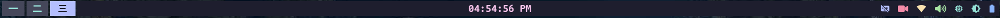
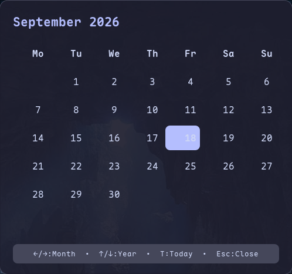
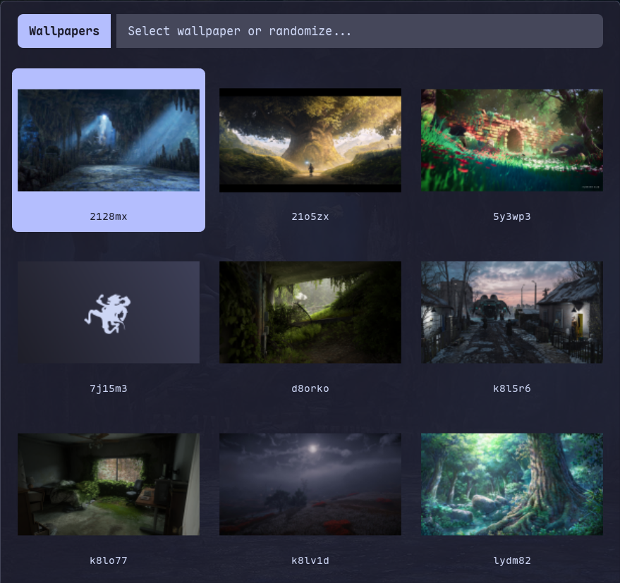
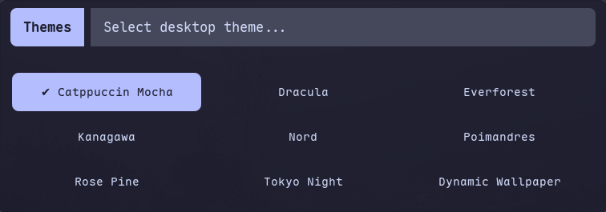
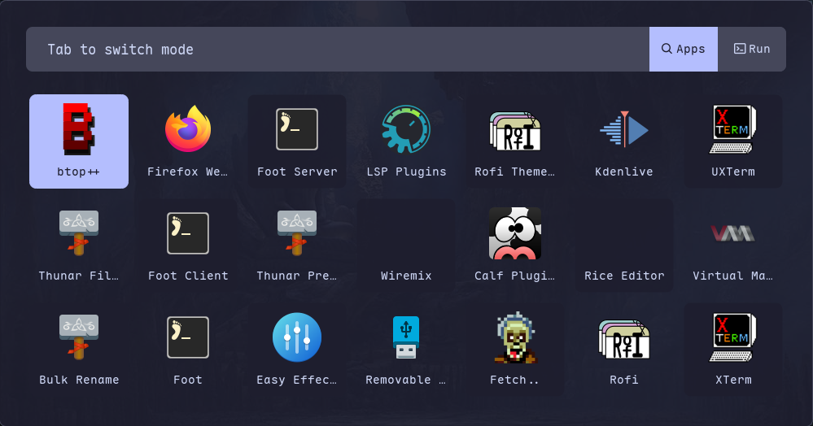
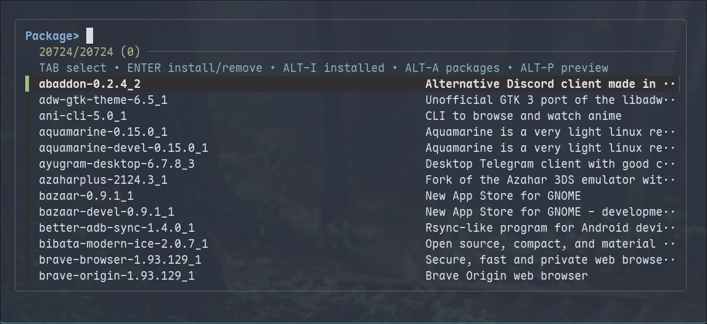
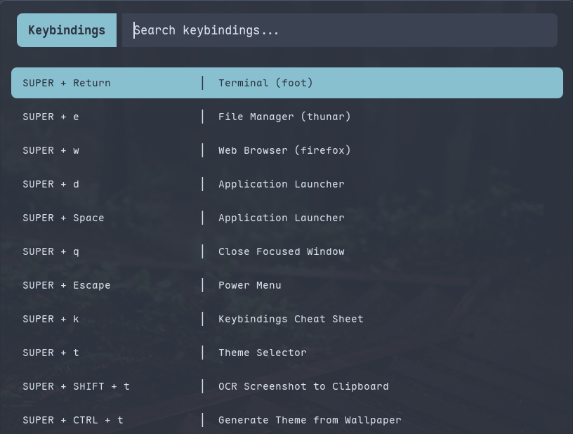

# <div align="center">Minimalist MangoWC Desktop Rice</div>

<div align="center">

A clean, lightweight, and keyboard-driven Wayland desktop environment built with **MangoWC** and **MangoBar**.

<br>

&ensp;[<kbd> <br> Install <br> </kbd>](#-installation)&ensp;
&ensp;[<kbd> <br> Features <br> </kbd>](#-features)&ensp;
&ensp;[<kbd> <br> Screenshots <br> </kbd>](#-screenshots)&ensp;
&ensp;[<kbd> <br> Keybindings <br> </kbd>](#-keybindings)&ensp;
&ensp;[<kbd> <br> Components <br> </kbd>](#-components)&ensp;

</div>

## Overview

A minimalist, keyboard-driven Wayland desktop built primarily for Void Linux, with support for Arch Linux and Debian/Ubuntu.
Modular configuration focused on simplicity and customization.

## Features

- Theme switching with 8 color schemes.
- Wallpaper-based palette generation using `pywal16`.
- Rofi menus for launching apps, wallpapers, power, audio, calendar, and clipboard.
- Screen recording with `wf-recorder` and `slurp` for fullscreen and region capture.
- Minimal GTK-based `key visualizer`.
- MangoWC and Foot for a Wayland-based desktop.
- Installers for Void Linux, Arch Linux, and Debian/Ubuntu.
- Modular, path-independent configuration.

## Screenshots

<div align="center">

### MangoBar


| Calendar Widget | Wallpaper Switcher |
| :---: | :---: |
|  |  |

| Theme Switcher | App Launcher |
| :---: | :---: |
|  |  |

| Power Menu | Power Profile |
| :---: | :---: |
|  |  |

| Package-Manager | Keybindings |
| :---: | :---: |
|  |  |

</div>

## ⚡ Installation

### Quick Start

Clone the repository and run the automated installer:

```bash
git clone https://github.com/h-jangra/wm.git ~/wm
cd ~/wm
./install.sh
```

The installer will:
1. Detect your Linux distribution (Void, Arch, or Debian/Ubuntu).
2. Install required dependencies and fonts.
3. Symlink configuration files cleanly into `~/.config/`.
4. Set up the Wayland desktop session.

### Starting the Session

- **Via Display Manager (Ly)**: Select **MangoWC** from the session menu.
- **Via Console (TTY)**:
  ```bash
  start-mango
  ```

## ⌨️ Keybindings

All primary keybindings use the **Super** (Windows) key:

| Shortcut | Action | Description |
| :--- | :--- | :--- |
| `Super + Return` | **Terminal** | Launch Foot client |
| `Super + D` / `Space` | **App Launcher** | Open Rofi application menu |
| `Super + E` | **File Manager** | Open Thunar |
| `Super + W` | **Browser** | Open Firefox |
| `Super + Q` | **Close Window** | Close focused window |
| `Super + T` | **Theme Switcher** | Interactive Rofi theme selector |
| `Super + Ctrl + T` | **Wallpaper Theme** | Extract palette from wallpaper (`pywal16`) |
| `Super + Shift + W` | **Wallpaper Menu** | Browse and select wallpapers |
| `Super + S` / `Print` | **Screenshot** | Interactive screenshot menu |
| `Super + V` | **Clipboard** | Search clipboard history |
| `Super + Escape` | **Power Menu** | Lock, Suspend, Reboot, Shutdown |
| `Super + F` | **Maximize** | Toggle window maximize |
| `Super + Shift + F` | **Fullscreen** | Toggle fullscreen |
| `Super + C` | **Float** | Toggle floating window |
| `Super + Tab` | **Overview** | Toggle workspace overview |
| `Super + [1-9]` | **Workspace 1-9** | Switch to workspace |
| `Super + Shift + [1-9]` | **Move Window** | Move window to workspace |
| `Super + H/J/K/L` | **Focus** | Navigate windows (Vim keys) |
| `Super + R` | **Reload** | Hot-reload configuration |

## 🧩 Components

| Component | Software | Description |
| :--- | :--- | :--- |
| **Compositor** | [MangoWC](https://github.com/DreamMaoMao/mangowc) | Fast wlroots + scenefx Wayland compositor |
| **Status Bar** | [MangoBar](https://github.com/mangowm/mangobar) | Native MangoWC top bar with system stats |
| **Terminal** | [Foot](https://codeberg.org/dnkl/foot) | Lightweight, fast Wayland terminal |
| **Launcher / Menus**| [Rofi-Wayland](https://github.com/davatorium/rofi) | App launcher, clipboard, and power menus |
| **Notifications** | [Mako](https://github.com/emersion/mako) | Lightweight Wayland notification daemon |
| **Wallpaper** | [swaybg](https://github.com/swaywm/swaybg) | Wayland wallpaper renderer |
| **Theming Engine** | Python + [pywal16](https://github.com/eylles/pywal16) | Dynamic palette generator & preset themes |
| **File Manager** | [Thunar](https://docs.xfce.org/xfce/thunar/start) | Fast GTK file manager |
| **Audio Server** | [PipeWire](https://pipewire.org) | Low-latency multimedia audio engine |
| **Display Manager**| [Ly](https://github.com/fairyglade/ly) | Minimal TUI display manager |
